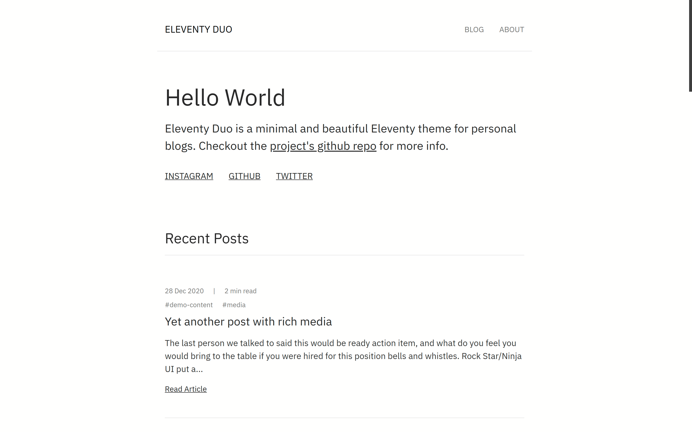

# Eleventy Duo

Eleventy Duo is a minimal and beautiful Eleventy theme for personal blogs.



### [Live demo](https://eleventyduo.netlify.app)

## Features

- Fully responsive

- SEO metadata and Open Graph tags

- Maximize lighthouse score

- Cache busting

- 404 page

- RSS feed for posts

- Tags support

- Pagination support

- Syntax highlighting with PrismJS

## Getting Started

- [Generate a new repo from this repository template](https://github.com/yinkakun/eleventy-duo/generate) which will copy this project into your own new repo.

- Clone your new repository with `git clone https://github.com/YOUR_REPO`,

- Navigate to the newly created repo

- Install dependencies with `yarn install`

- Serve the site locally with `yarn dev`

- Use `yarn build` to build a production version of the site.

## Customize

Open `data/site.json` and adjust the values to your details, it contains vital information to make the site your own. You'll need to change the description, title and url to match with the project, edit navigation items and social media links.

You'll also need to replace the favicon and default social image in the `src/images/` directory with your own graphics.

## Manually Edit contents

### Homepage

Edit the homepage content at `src/index.md`.

Sample frontmatter for homepage.

```
---
layout: home
title: 'Eleventy Duo'
---

Contents
```

### About page

Edit the about page content at `src/about.md`.

Sample frontmatter for about page.

```
---
title: About Aidan Charles Powell
layout: about.njk
name: Aidan Charles Powell
image: '/images/me.jpeg'
---

Contents
```

### Blog posts

Blog contents is at `src/posts`. Delete placeholder blog posts. Do not delete the `posts.json` file. Create blog posts in markdown format.

Sample frontmatter for blog posts.

```
---
title: Even yet another post with rich media
date: '2020-12-24'
tags: [demo-content, media]
decription: The last person we talked to said this would be ready action item, and what do you feel you would bring to the table if you were hired for this position bells and whistles. #optional
---

Contents
```

### Generic pages

You can create generic pages in markdown format that use a base layout.

Sample frontmatter for generic pages.

```
---
layout: base
permalink: /generic-page
title: Generic page
---

Contents
```

## Using Forestry as your CMS

This project is preconfigured to work with Forestry as a way to manage your content. Forestry makes changes by editing markdown or data files, uploading media to the correct directory and committing these updates to your repo directly.

Eleventy Duo has Forestry CMS pre-configured as standard. You can customize the configuration by editing `.forestry/settings.yml.`

Sign up for a free [Forestry](https://forestry.io) account

Import your repo as a new [Eleventy project](https://forestry.io/docs/quickstart/setup-site/#import-site-from-repo)

Once the site is imported in Forestry, go to settings/previews to start the preview server. You'll be able to preview the final rendering before publishing.

The basic CMS setup allows you to edit the following:

- Home page: Edit the content on your homepage.

- About page: Edit the content of your about page.

- Posts: Create and edit blog posts.

- Generic pages: Create generic pages that use a similar layout to posts.

- Global site data: Various bits of global site data such as your url, title, and other details.

You can add new blog posts, [data files](https://forestry.io/docs/editing/data-files/), or entire pages to fit your needs. You can also customize [how media is handled](https://forestry.io/docs/media/), by configurating gitLFS, Cloudinary, S3, or Netlify Large Media.

You can set up a [remote admin](https://forestry.io/docs/editing/remote-admin/) for content editors to log in directly to yoururl.com/admin to make content updates.

## Deployment

[Netlify](https://netlify.com) is a great way to easily deploy sites. There's no special setup you need to do with Forestry to deploy with Netlify. When Forestry makes commits to your repo, Netlify will auto-trigger a rebuild / deploy when new commits are made.

- Create a new site in Netlify and import your repository.

- Set the build command to `yarn build`

- Set the publish directory to `public`

## Built with

- Eleventy for site generation (obviously)

- Webpack for asset bundling

- PostCSS for CSS processing

- Autoprefixer for vendor prefixing CSS

- PostCSS Preset Env for transpiling css

- PurgeCSS for unused CSS removal

- CSSNano for CSS minification

## License

This project is licensed under the MIT License.

Isn't Jamstack beautiful?
