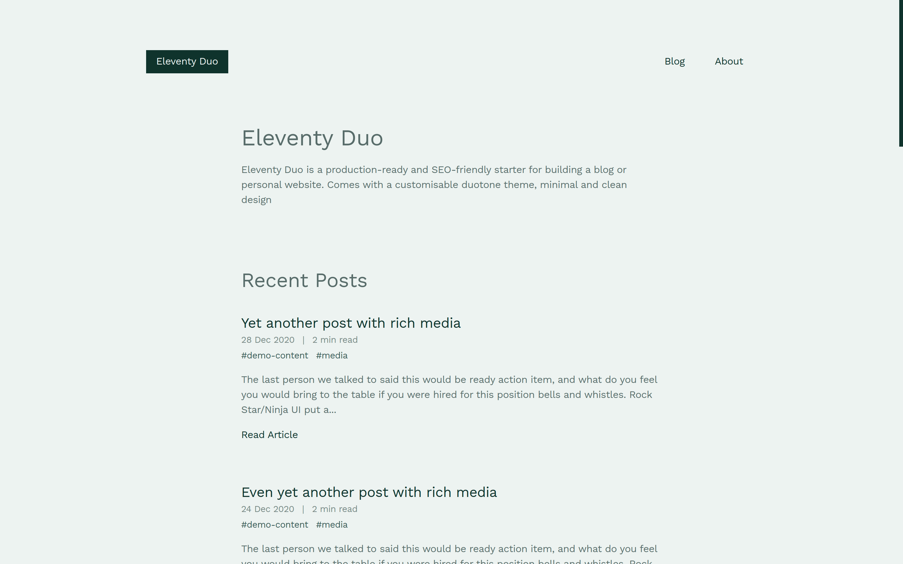
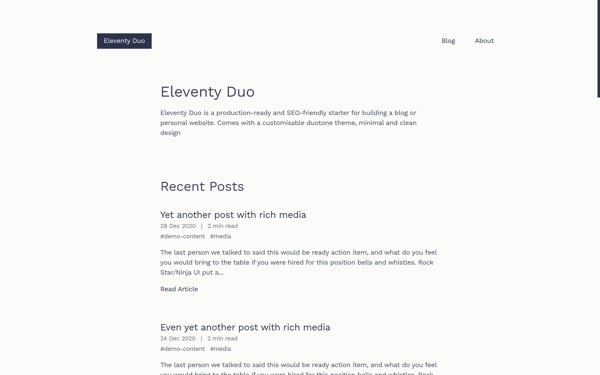
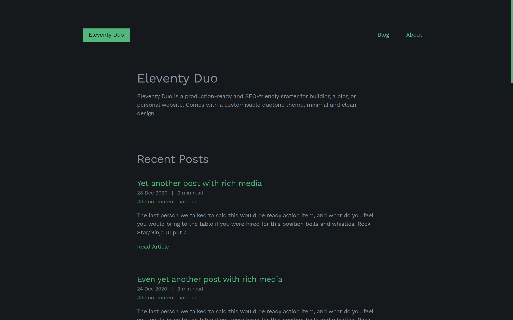
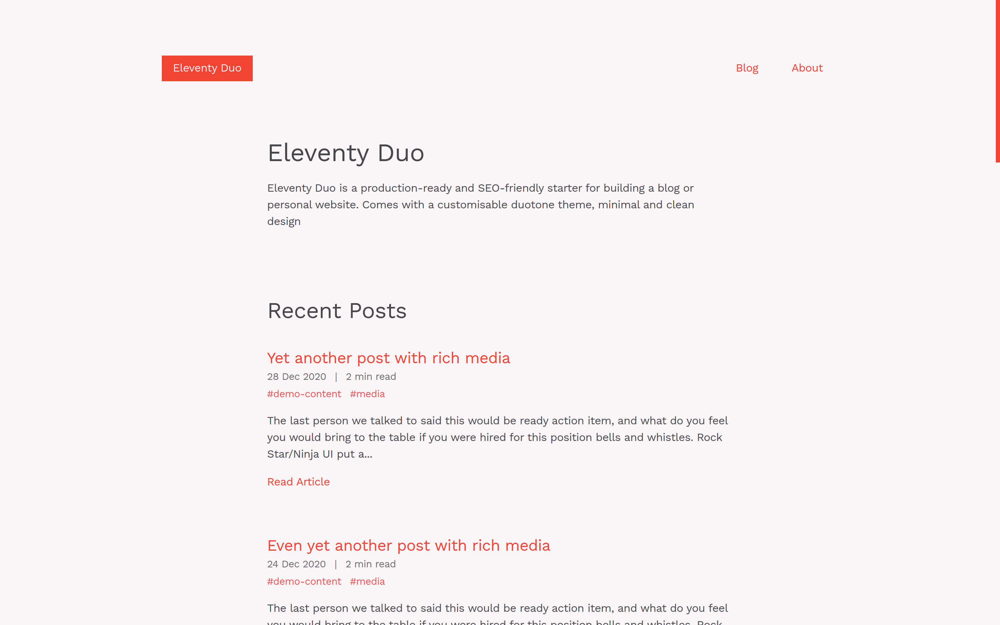

# Eleventy Duo

Eleventy Duo is a production-ready and SEO-friendly starter for building a blog or personal website. Comes with a customizable duotone theme, minimal and clean design.


### [Live demo](https://eleventyduo.netlify.app)

## Built with

- Eleventy for site generation (obviously)

- Webpack for asset bundling

- PostCSS for CSS processing

- Autoprefixer for vendor prefixing CSS

- PostCSS Preset Env for traspiling css

- PurgeCSS for unused CSS removal

- CSSNano for CSS minification

## Features

- Customizable duotone theme to make it your own.

- Fully responsive

- SEO metadata and Open Graph tags

- Maximize lighthouse score

- Cache busting

- 404 page

- RSS feed for posts

- Tags support

- Pagination support

- Syntax highlighting with PrismJS

## Getting Started

### Generate a new repository from this repository template

Click the ["Use this template"](https://github.com/yinkakun/eleventy-duo/generate) button. Alternatively, you can clone this repo yourself and push your copy to a git repository.

### Clone your new repository

```
git clone https://github.com/YOUR_REPO
```

### Navigate to the directory

```
cd my-blog-name
```

### Install dependencies

```
yarn install
```

### Serve the site locally

```
yarn dev
```

### Build a production version of the site

```
yarn build
```

## Project structure

```
src/
  data/
    Eleventy data files
  layouts/
    Base page layouts
  includes/
  	All UI partials
  blog/
    Blog posts in markdown
  assets/
    css/
      main.css
      All other scss files
    js/
      main.js
      All other js files
  images/
    All images used
  page template files
Configuration and build files
```

Files in `assets` will be handled by webpack.

Eleventy will transform files in `data`, `layout` and `includes` directories, and will copy across any `images`.

Eleventy’s output will be to a `public` directory at the root level.

## Customize

- Edit site data `data/site.json`

This file contains your site title and author details and can be used to store any other commonly used site data.

```json
{
  "name": "Eleventy Duo",
  "description": "Eleventy Duo is a production-ready and  SEO-friendly starter for building a blog or personal website. Comes with a customizable duotone theme, minimal and clean design.",
  "url": "https://eleventyduo.netlify.app",
  "author": {
    "name": "Author Name",
    "email": "author@site.com",
    "twitterHandle": "author_handle"
  },
  "socialImage": "/images/social-image.jpg"
}
```

- Replace favicon in `src/favicon.ico`. Default is a paint palette image.

- Replace social image in `src/images/social-images.png` Default is a screenshot of demo site.

- Update Site title and introduction that appears on the homepage in `src/index.md`

```
---
layout: home
title: 'Eleventy Duo'
---

Eleventy Duo is a production-ready and SEO-friendly starter for building a blog or personal website. Comes with a customisable duotone theme, minimal and clean design.

Checkout the [project's github repo](https://github.com/yinkakun/eleventy-duo) for more info.

```

- Update the About page

Update the about page content in `src/about.md`

```
---
title: About
layout: base.njk
---

Eleventy Duo is a production-ready and SEO-friendly starter for building a blog or personal website. Comes with a customisable duotone theme, minimal and clean design.

Checkout the [project's github repo](https://github.com/yinkakun/eleventy-duo) for more info.


```

- Add blog post

Blog posts is in markdown. The starter already contains some demo contents.

The `description` frontmatter is used in meta description and Open Graph description for SEO. If not provided, it falls back to the first 140 characters of the article instead.

The `socialImage` frontmatter is used in Open Graph image ad Twitter card image for SEO. If not provided, it falls back to the `site.socialImage` provided in `data/site.json`

```
---
title: Demo blog post.
date: 2020-12-06
tags: [css, html, markdown]
description: this description will be used in page metadata tags for SEO
socialImage: images/name-of-image.png

Page content here...
---
```

- Customize site theme, adjust these CSS variables at `src/assets/css/theme.css`, some nice presets are:

Mariner & Black White

```css
:root {
  --accent: #2979b7;
  --background: #fffffe;
  --color: #2d334a;
}
```


Deep Teal & Saltpan

```css
:root {
  --accent: #00332c;
  --background: #f2f7f5;
  --color: #475d5b;
}
```



Martinique & Black White

```css
:root {
  --accent: #2d334a;
  --background: #fffffe;
  --color: #2d334a;
}
```



Jungle Green & Woodsmoke

```css
:root {
  --accent: #2cb67d;
  --background: #16161a;
  --color: #94a1b2;
}
```



Pomegranate & Soft Peach

```css
:root {
  --accent: #f03d33;
  --background: #fbf9fb;
  --color: #343239;
}
```



Otherwise: Knock yourself out. This is a template repository.
